# Time Series Forecasting for Portfolio Management Optimization

This repository contains code and resources for forecasting stock prices to optimize portfolio management. By leveraging time series analysis, the project aims to develop predictive models that assist in making informed investment decisions, balancing risks and returns based on historical stock data.

## Project Overview

With stock market volatility and the increasing complexity of financial portfolios, time series forecasting is essential for anticipating price trends and making proactive portfolio adjustments. This project uses various time series forecasting models to predict stock prices, evaluate model accuracy, and optimize investment strategies. 

## Table of Contents

- [Project Overview](#project-overview)
- [Features](#features)
- [Technologies Used](#technologies-used)
- [Setup Instructions](#setup-instructions)
- [Usage](#usage)
- [Results](#results)
- [Future Work](#future-work)
- [Contributing](#contributing)
- [License](#license)

## Features

- **Data Preprocessing**: Cleans and formats stock data for analysis.
- **Exploratory Data Analysis (EDA)**: Visualizes and analyzes historical price trends.
- **Time Series Forecasting**: Implements models like ARIMA, Prophet, LSTM, and XGBoost for price prediction.
- **Model Evaluation**: Compares models based on error metrics to select the most accurate one.
- **Portfolio Optimization**: Simulates investment scenarios and evaluates performance metrics.

## Technologies Used

- **Python**: The primary programming language used.
- **Libraries**:
  - **Pandas** and **NumPy**: For data manipulation and numerical operations.
  - **Matplotlib** and **Seaborn**: For visualizations and EDA.
  - **scikit-learn**: For preprocessing and model evaluation.
  - **statsmodels**: For ARIMA modeling.
  - **TensorFlow/Keras**: For building LSTM models.


## Data

The dataset includes historical stock prices obtained from [data source, e.g., Yahoo Finance](https://finance.yahoo.com/) . Each entry typically includes:
- Date
- Open, High, Low, Close prices
- Volume

## Setup Instructions

1. **Clone the repository**:
    ```bash
    git clone https://github.com/wolderufael/Time-Series-Forecasting-for-Portfolio-Management-Optimization.git
    cd Time-Series-Forecasting-for-Portfolio-Management-Optimization
    ```

2. **Create a virtual environment**:
    ```bash
    python -m venv venv
    source venv/bin/activate  # On Windows use `venv\Scripts\activate`
    ```

3. **Install the required packages**:
    ```bash
    pip install -r requirements.txt
    ```

4. **Configure API Access** (if required):
   - Set up environment variables for API keys if you’re using a service like Yahoo Finance for live data retrieval.

## Usage

1. **Data Preparation**:
   - Run the `data_preprocessing.py` script to download and preprocess data.
   
   ```bash
   python src/data_preprocessing.py


## Result 
Exploratory Data Analysis Results
### Time series plot
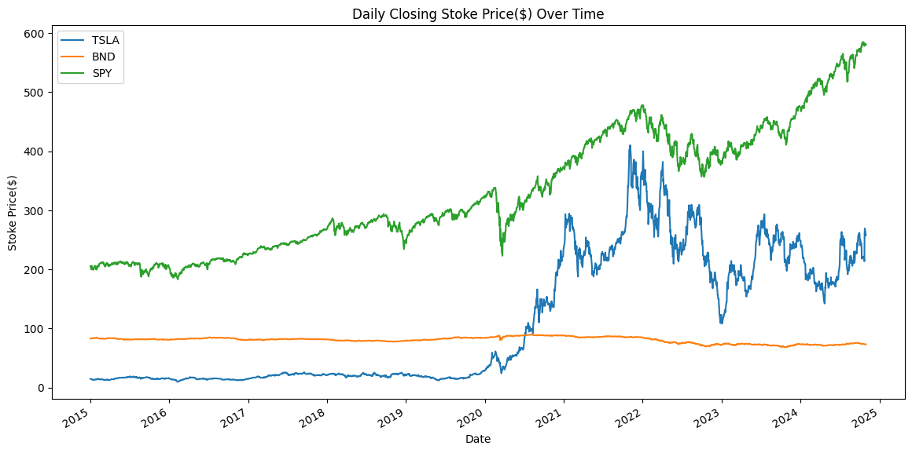
### Daily return
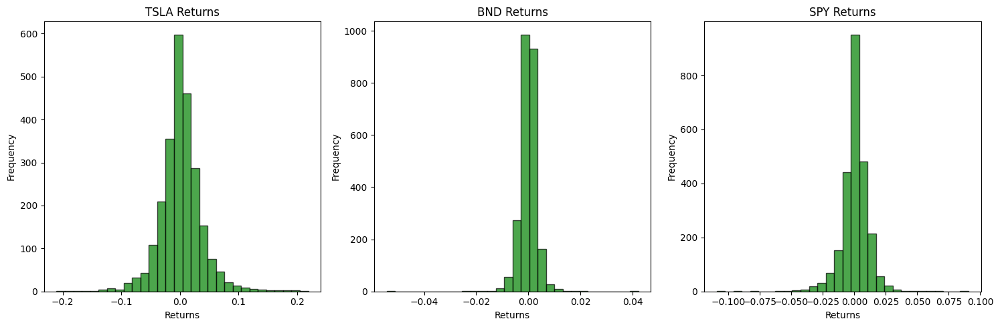
### Rolling Mean and Standard Deviation
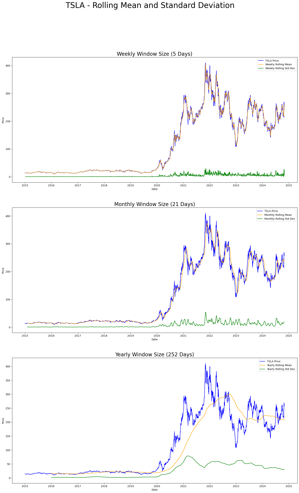
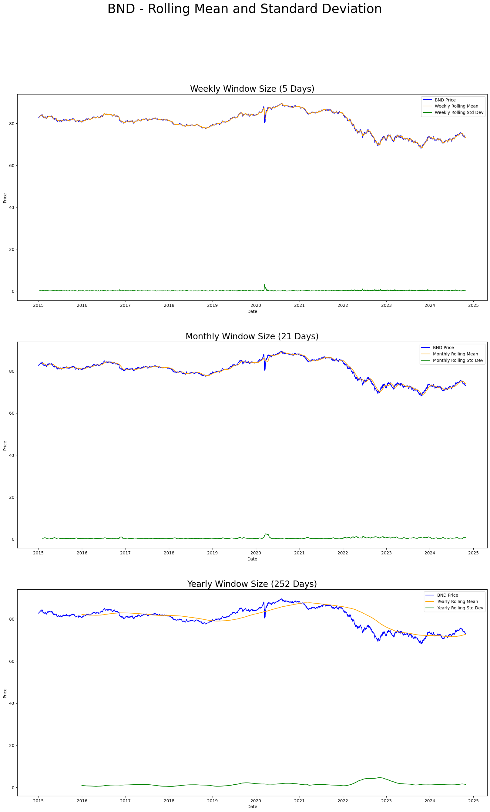
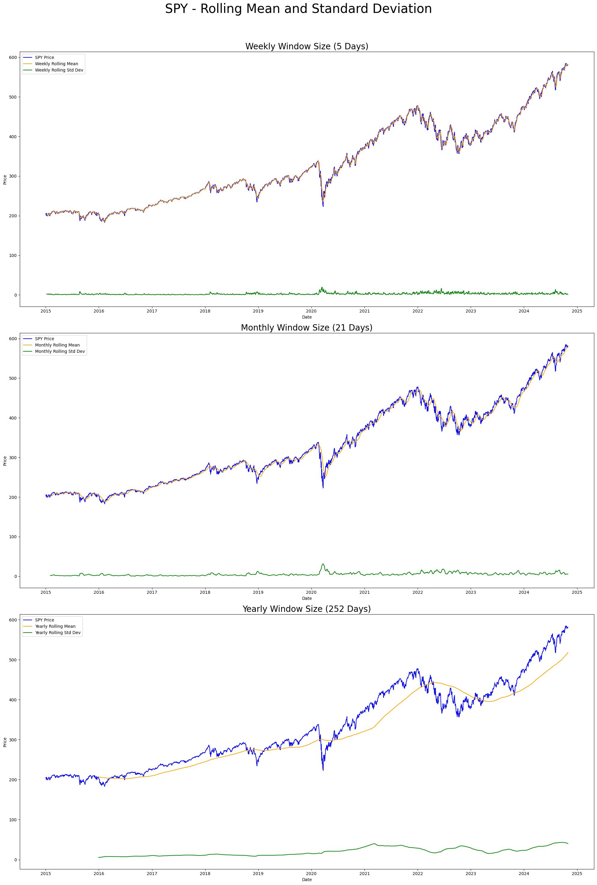
### Outlier Detection
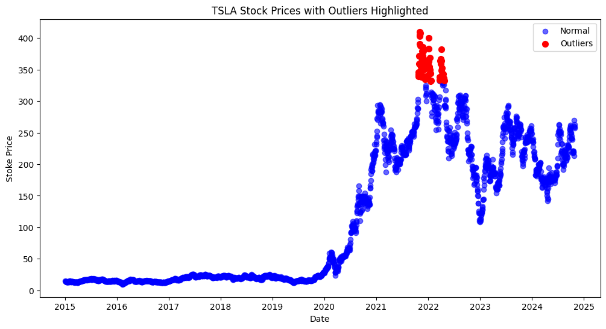
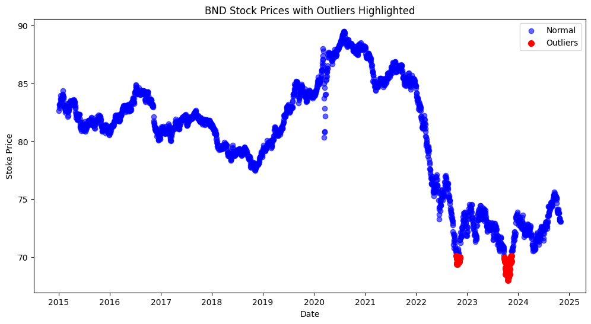
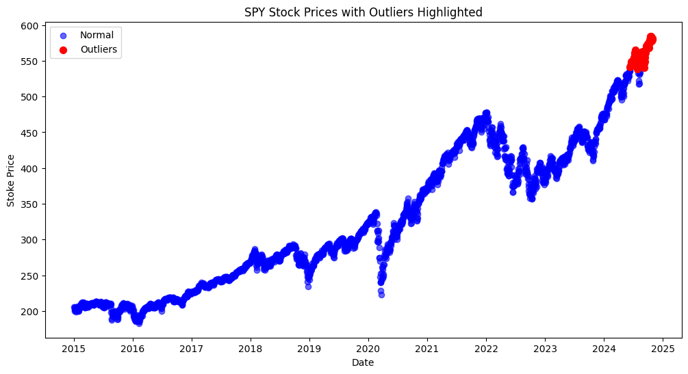
### Seasonal Decompose
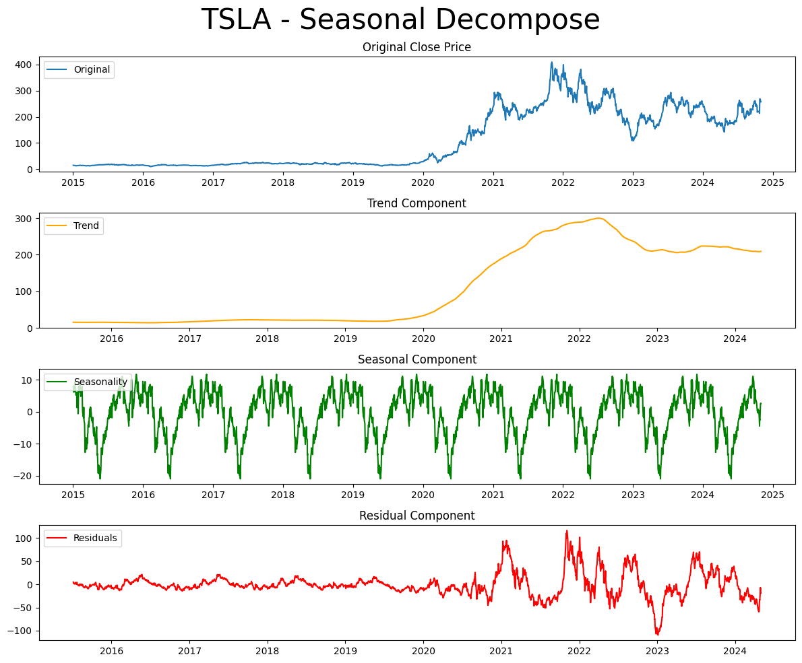
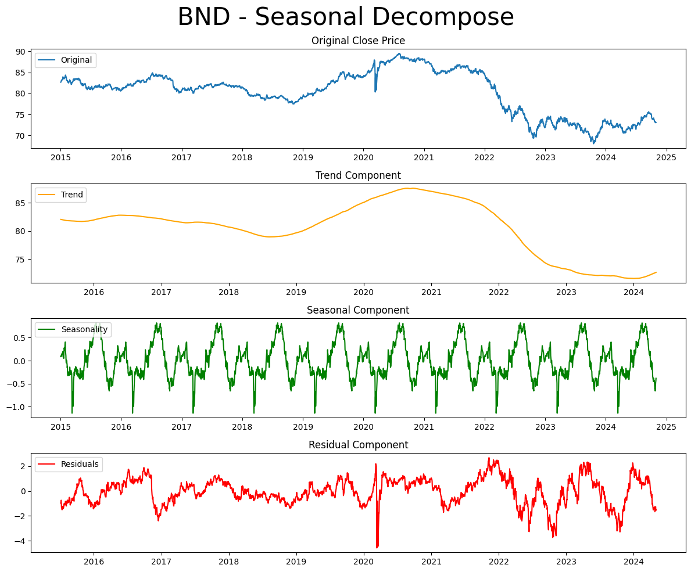
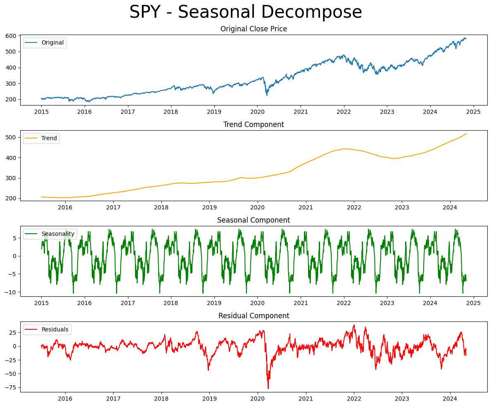
### LSTM forecast
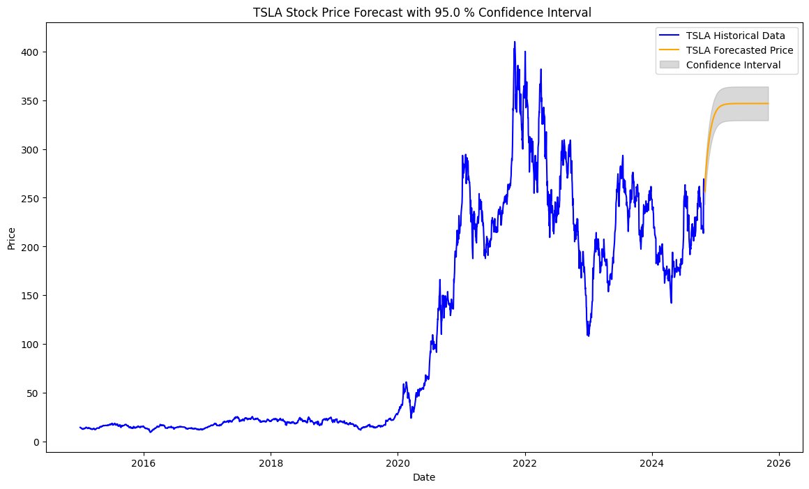
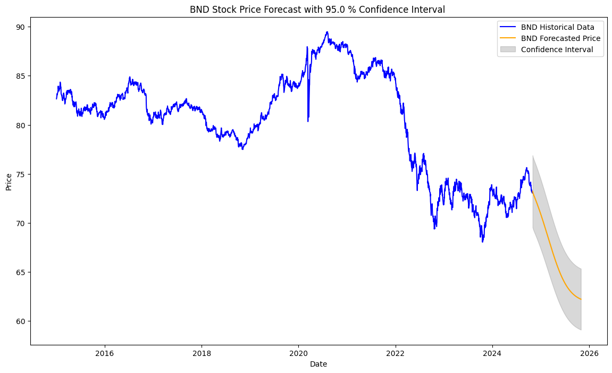
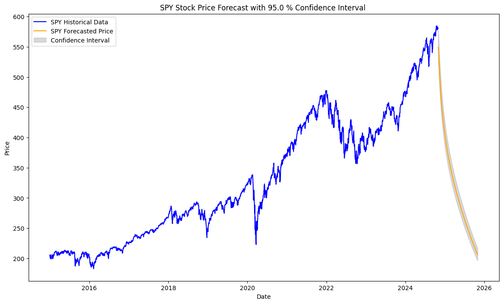
### Portfolio
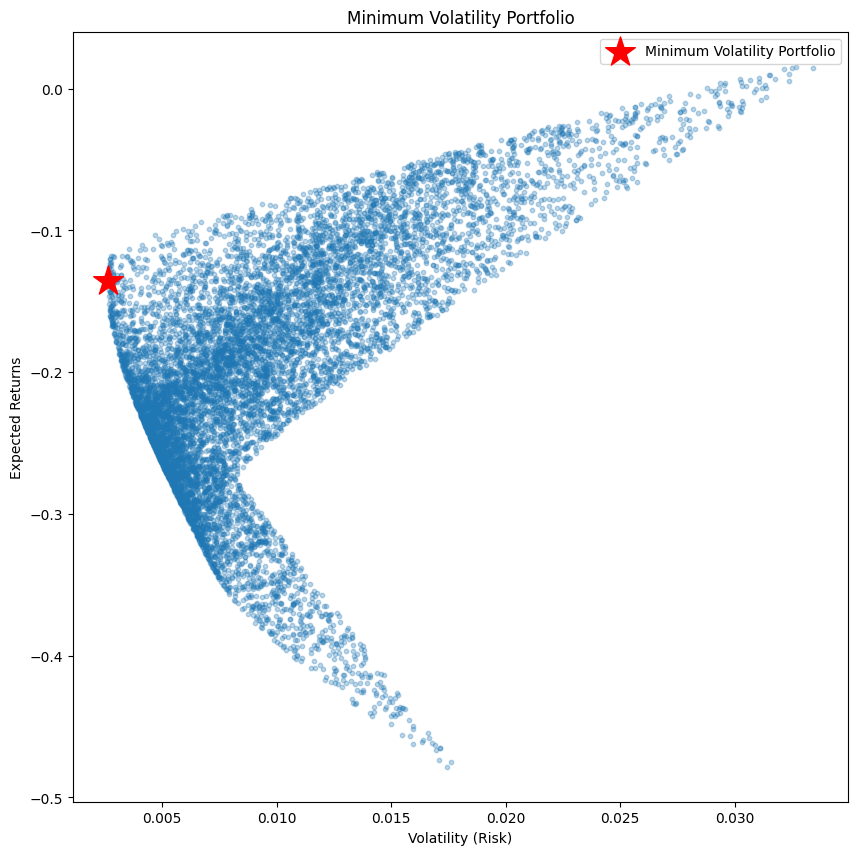
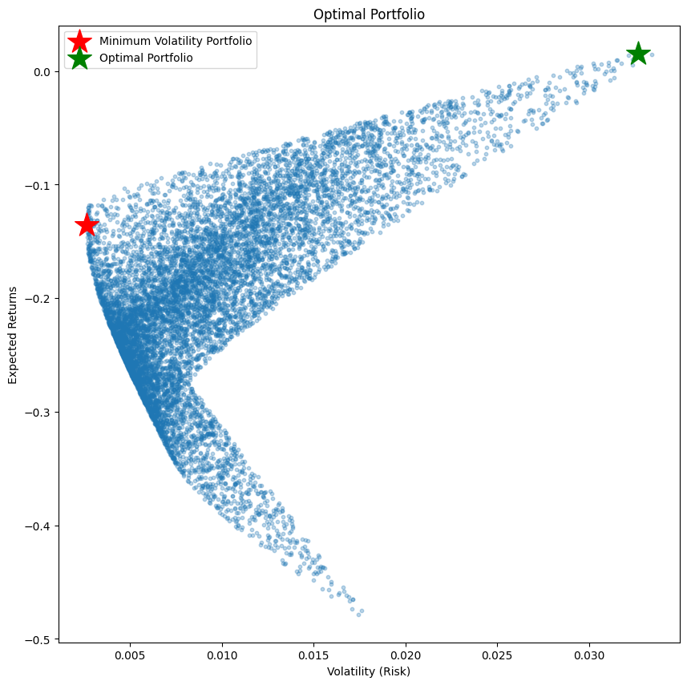

## Contributing
Contributions to improve this project are welcome. If you'd like to contribute, please fork the repository and submit a pull request.

## License
This project is licensed under the MIT License. See the LICENSE file for details.
